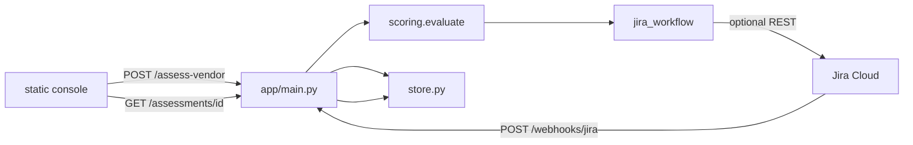
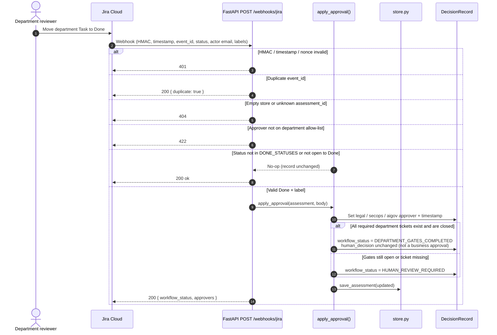

# Architecture — Enterprise AI Risk Console

This document describes **how** the system is built. For **why**, trade-offs, and limitations, see [ARCHITECTURE_DECISIONS.md](ARCHITECTURE_DECISIONS.md).

## Design principles

(These are expanded as ADRs in [ARCHITECTURE_DECISIONS.md](ARCHITECTURE_DECISIONS.md).)

1. **Evidence → controls → risk factors → score → triage** — fixed pipeline in `app/scoring.py`.
2. **LLM explains; engine triages** — `app/llm.py` never sets `decision` or `risk_score`.
3. **Humans approve in Jira** — decentralized gates; console orchestrates tickets.
4. **Missing evidence never reduces risk** — conservative by design for enterprise sales and audit.

## Component map

```
┌─────────────────┐     POST /assess-vendor      ┌──────────────────┐
│  static/        │ ───────────────────────────► │  app/main.py     │
│  index.html     │   GET /config, /assessments/id │  FastAPI         │
│  app.js         │   GET /assessments/{id}/audit  └────────┬─────────┘
└─────────────────┘ ◄───────────────────────────────────────┤
                                                              │
                    ┌─────────────────────────────────────────┼─────────────────────────┐
                    │                                         │                         │
                    ▼                                         ▼                         ▼
             app/scoring.py                          app/jira_workflow.py          app/store.py
             evaluate() + rules/gdpr.yaml            build_epic_and_subtasks()     SQLite + hash chain
             frameworks.py (alignment YAML)          publish_to_jira()             intake, token, Jira map
                                                   apply_approval()              audit_events / audit_heads
                    │                                         │
                    └─────────────────┬───────────────────────┘
                                      ▼
                              AssessmentResponse
                              (Pydantic / OpenAPI)
```



## Scoring engine (`app/scoring.py`)

**Version:** `deterministic-rules-v1` (constant `ENGINE_VERSION`).

Control checks and residual score live in Python. The **triage decision** is
evaluated from the validated `rules/gdpr.yaml` profile (`mode: decision`) via
`evaluate_gdpr_decision()`. EU AI Act, ISO/IEC 42001, and NIST AI RMF YAML
files are `mode: alignment` only — they cannot contain decision rules and are
never consulted for `decision` or `risk_score`.

### Control evaluation order

| Control ID | Topic |
|------------|--------|
| CTRL-DPA | Data processing agreement |
| CTRL-DPIA | Privacy impact assessment |
| CTRL-TRANSFERS | Geographic scope / international transfers |
| CTRL-RETENTION | Retention period |
| CTRL-ART9 | Special category data (GDPR Art. 9) |
| CTRL-ADM | Automated decision-making |
| CTRL-SOC2 | Independent security pack (always missing without upload) |
| CTRL-MODEL | Foundation model transparency |

Each control produces an `EvidenceItem` and `ControlAssessment`.

### Score (1–5)

Base score 2, increments for personal data, no DPA, Art. 9, ADM, incomplete DPIA, unknown transfers. Capped at 5.

### Triage decision matrix (`rules/gdpr.yaml`)

| Condition | Decision |
|-----------|----------|
| Personal data + no DPA | ESCALATE |
| Art. 9 + (no DPA or no DPIA) | ESCALATE |
| Score ≥ 5 | ESCALATE |
| Score ≥ 4, or DPIA gap, or no DPA | REQUIRES REMEDIATION |
| Otherwise | PENDING REVIEW |

**Never:** engine `APPROVE`. Changing triage requires a YAML (and test) change, not a prompt tweak.

## Jira workflow (`app/jira_workflow.py`)

### Outbound

1. `build_epic_and_subtasks()` after scoring (Epic + department **Tasks**, not Sub-tasks).
2. `publish_to_jira()` if `JIRA_BASE_URL` + `JIRA_API_TOKEN` set.
3. Descriptions converted to Atlassian Document Format (ADF).
4. Extension field `department` stripped before POST (`parent | legal | infosec | aigov`).
5. Department tickets use `parent = {key: epicKey}`. Classic projects that still need Epic Link can set `JIRA_EPIC_LINK_FIELD`.

### Inbound webhook

`POST /api/v1/webhooks/jira`

- Parses Jira `issue.updated` or minimal test JSON.
- Requires HMAC-SHA256 of the raw body (`X-Hub-Signature-256`) using the active secret or, during rotation, `JIRA_WEBHOOK_SECRET_PREVIOUS`. Timestamp window and unique `X-Jira-Event-Id` also apply.
- Requires status in `DONE_STATUSES` and a real open → Done transition (`previous_status` or changelog).
- Requires the Jira **actor** (`user.emailAddress`) to match the department allow-list (`dpo@`, `secops@`, `aigov@`), not merely the corporate domain. The issue assignee is never treated as the approver.
- Maps labels: `legal-review`, `infosec`, `ai-governance-review`.
- Updates `DecisionRecord` approver fields and timestamps.
- When all **required** department tickets exist and are closed → `workflow_status=DEPARTMENT_GATES_COMPLETED`. That is **not** a business approval (`human_decision` stays empty). `HUMAN_APPROVED_WITH_CONDITIONS` is reserved for a later final decision-maker. Missing tickets are never treated as approval.



### Outbound resilience

`publish_to_jira()` is **best-effort**. The assessment is the product; Jira is orchestration.

| Event | Behaviour in this release |
|-------|---------------------------|
| Credentials unset | Dry-run. Returns `{published: false, reason: "..."}`. HTTP 200 with full `jira_tickets[]`. |
| Network error, timeout (`httpx` 10s / connect 3s), or HTTP 4xx/5xx | `httpx` `raise_for_status()` / transport exception. Caught in `assess_vendor`. Assessment **still saved and returned**. |
| Partial create | Epic POST succeeds, a department Task POST fails: already-created issues are **deleted** (best-effort rollback via `DELETE /issue/{key}`). If a delete fails, the error is logged (`jira.rollback`). No retry queue. |
| Recorded on audit | `decision_basis` appends `JIRA_PUBLISH:True` or `JIRA_PUBLISH:False`. Failure reason is in the caught exception string, not a 500 to the assessor. |

There are **no automatic retries** and no idempotency keys. That is deliberate for the Demo / PoC (ADR-13): inventing a retry worker without a durable store would duplicate Epics. Production (roadmap step C) should add retries with backoff, idempotent create, and `assessment_id` correlation.

Do **not** treat a green assessment HTTP 200 as “tickets exist in Jira”. Check `JIRA_PUBLISH:` on `decision_record.decision_basis` or `GET /api/v1/health/details` → `jira_outbound`.

## Data models (`app/models.py`)

Key types:

- `VendorInput` — intake form / API body
- `AssessmentResponse` — full API response
- `DecisionRecord` — audit trail (engine + human gates)
- `JiraTicket` / `JiraFields` — Jira REST v3 shape + `department` metadata
- `GovernanceEvidencePack` — machine-readable audit bundle

## Assessment store (`app/store.py`)

SQLite persists intake, assessment/evidence pack, access-token digest, Jira
issue map, webhook event IDs, and hash-chained audit events under `DATA_STORE`.
Rows are keyed by `assessment_id`, TTL-capped, and recover after process
restart. Retrieval never falls back to a global “latest” row. Creation and
decision/workflow updates append an event in the same SQLite transaction; each
event hashes its canonical payload and the previous event hash. A separate
same-database head/count checkpoint detects broken links and simple tail
truncation.

This closes restart loss for a single deployment, not production tenancy:
SQLite has no tenant ownership/RLS. The hash chain is tamper-evident, not
tamper-proof: an attacker able to rewrite the whole database can rewrite its
checkpoint and the local `audit_anchors` table too. External attesters are
configured via `AUDIT_ANCHOR_SINKS` (default `jira` dry-run; optional Rekor
and S3 Object Lock). Jira dry-run is not WORM. See ADR-16.

## External audit-root anchors (`app/audit_anchor.py`)

On each chain append the process records `seq`, `root_hash`, `prev_root`,
timestamp, sink, and status in `audit_anchors`, then calls configured sinks.
`GET /api/v1/assessments/{id}/audit` verifies (1) local chain integrity and
(2) whether the current head matches the last successful external ref.

## Framework catalog (`app/frameworks.py`)

`COMPLIANCE_FRAMEWORKS` scopes optional EU AI Act, ISO/IEC 42001, and NIST AI
RMF alignment sections. YAML files in `rules/` are validated at startup.
Only `gdpr.yaml` has `mode: decision` and drives the existing deterministic
DPA/DPIA/Art. 9/score triage. The other profiles must be `mode: alignment`;
validation rejects decision rules in them. Their mappings are metadata, not
implemented certification or framework-specific decision engines.

`API_ACCESS_TOKEN` is one shared deployment secret. It is an API gate, not
user identity, OIDC, AD/SSO, roles, tenant ownership, or authorization.

## Web console (`static/`)

Vanilla HTML/CSS/JS — no SPA framework (ADR-5). Served from the same FastAPI process as `/api/v1/*`.

| File | Role |
|------|------|
| `index.html` | Two-column layout: intake form (left) + workspace (right) |
| `styles.css` | Dark governance palette; sticky decision bar; tabbed report; status chips |
| `app.js` | Form → API, render summary/audit/report, tab switching, disclosure rows, assistant card, chat |

### Right-panel layout (v1.7)

The workspace column is the **only** vertical scroll container on the right. Report sections do not nest their own scrollbars.

```
Decision bar (sticky)
  → Audit trail grid + gate chips
  → Tabs: Findings | Missing evidence | Jira orchestration
  → Risk assistant card (structured, not plain text)
  → Chat messages + suggestion chips
  → Composer (sticky)
```

### Rendering rules (`app.js`)

| Pattern | Implementation |
|---------|----------------|
| Progressive disclosure | `splitHeadline()` + `<details>` rows — headline visible, rationale on expand |
| Evidence gaps | `CTRL-*` title + status chip (`missing`, `insufficient`); excerpt/document/source in row body |
| Audit trail | `statGrid()` for labelled fields; `gateChip()` for Legal / SecOps / AI Gov |
| Assistant seed | `assessmentCard()` — visual card; `formatAssessment()` plain text for clipboard and LLM `history` |
| XSS | `escapeHtml()` on all user/vendor text rendered as HTML |

## Chat (`app/llm.py` + `app/prompts.py`)

- System prompt forbids inventing certifications and changing engine decisions.
- Assessment JSON and intake passed as context on each chat turn.
- `mock_chat()` provides deterministic keyword routing without OpenAI.

## Historical LLM assessment prompt (unused)

Scoring is deterministic (`evaluate()`). An earlier design asked an LLM to emit the
assessment JSON. That contract is not loaded by the API. It is kept here so the
governance rules it encoded remain reviewable:

```
You are an Enterprise Third-Party AI Risk Assessment Agent operating within a Responsible AI Governance framework.

Your objective is to assess the AI-related risk of a third-party vendor using ONLY:
- explicit user input in the request JSON
- evidence the user supplied
- Do NOT invent SOC 2 reports, DPAs, DPIAs, certifications, fines, CVEs, or incidents.
- If a control or document is not in the user input, write EVIDENCE NOT FOUND.

Decision MUST be exactly one of (engine triage — never a final APPROVE):
- PENDING REVIEW
- REQUIRES REMEDIATION
- ESCALATE TO AI GOVERNANCE / LEGAL / SECURITY
```

The user turn was the intake JSON plus the UTC date. Do not restore this path in `run_assessment()`.

## Security considerations

- `JIRA_WEBHOOK_SECRET` and `JIRA_APPROVER_DOMAIN` are required at process startup (`ConfigurationError` / uvicorn exit). HMAC of the raw body is mandatory on inbound webhooks. `JIRA_WEBHOOK_SECRET_PREVIOUS` is optional for a bounded rotation window.
- Approvers must be on the department allow-list (`dpo@` / `secops@` / `aigov@` plus `JIRA_APPROVER_DOMAIN`, or `JIRA_ALLOWED_APPROVERS`), not merely any mailbox on the domain.
- `GET /api/v1/config` is public and contains no secrets. `GET /api/v1/health/details` is gated by `HEALTH_DETAILS_TOKEN` when that variable is set.
- Restore, audit export, and chat require an explicit `assessment_id`. `GET /api/v1/assessment/latest` is deprecated and still needs `X-Assessment-Id`; it never returns a global latest row.
- Rate limits use the TCP peer unless that peer is in `TRUSTED_PROXIES`.
- Do not commit `.env` with real tokens.
- Chat history is client-side; not persisted server-side in this release. LLM context is redacted (heuristic + known fields).

## Extension points

| Need | Approach |
|------|----------|
| New control | Add `eval_*()` in `app/scoring.py`, new `CTRL-*` id, rules in `decision_basis` |
| New triage branch | Edit `rules/gdpr.yaml` (decision profile) and golden tests — not alignment YAML |
| New department gate | Extend `departments()` + `build_epic_and_subtasks()` + `DecisionRecord` fields |
| Multi-tenant store | Replace SQLite in `store.py` with PostgreSQL + RLS; keep Pydantic models |
| PDF export | Render `evidence_pack` JSON to template (future) |
