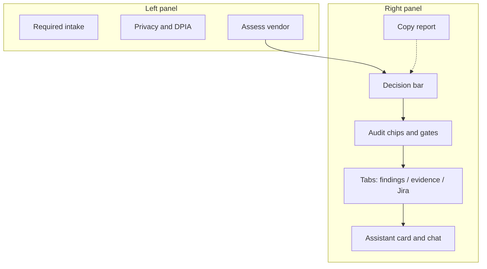

# User Guide — Enterprise AI Vendor Risk Console

**Version:** 1.7 · **Audience:** Business, Legal, Compliance, Security, Leadership  
**Classification:** Internal use

## What this tool is

A **governance control layer** for third-party AI vendors. You describe what you want to buy or integrate; the system:

1. Checks controls against the facts you provided (not vendor marketing).
2. Produces a **triage decision** and residual risk score (1–5).
3. Opens **Jira work** for Legal, SecOps, and AI Governance to approve in their own tools.
4. Lets you ask follow-up questions in chat (grounded in the assessment).

This is **not** legal advice and **not** a substitute for signed contracts or a DPO opinion.

## What the engine decides vs humans

| Actor | Can approve vendor? |
|-------|---------------------|
| Rules engine | **No.** Only triage: `PENDING REVIEW`, `REQUIRES REMEDIATION`, or `ESCALATE`. |
| Chat / LLM | **No.** Explains the report only. |
| Legal (Jira) | Closes DPA/DPIA gate — `dpo@adevinta.com` queue |
| SecOps (Jira) | Closes SOC 2 / security gate |
| AI Governance (Jira) | Closes model risk gate |
| All three closed | Workflow → **Department gates completed — awaiting final approval** |

## How to run an assessment

1. Open the console (default `http://127.0.0.1:8000`).
2. Complete **minimum required fields**: vendor name, service, intended use, data processed.
3. Check **DPA signed and archived** only if a real Data Processing Agreement exists with your entity.
4. Expand **Privacy and DPIA** if personal data, transfers, or automated decisions apply.
5. Click **Assess vendor**.
6. Read **Decision** (triage) and **Residual risk** in the top bar, then the audit chips below it.
7. Open the **Findings**, **Missing evidence**, and **Jira orchestration** tabs. Each row shows the headline; click a row to read the full rationale and its source.
8. Use chat or suggestion chips for follow-up questions.

**Tip:** Pre-filled values are an **example** (OpenAI). Clear them for a real case.

## Where things are on the console

The window is two columns. You never need to hunt for the decision: the bar stays pinned to the top of the right column while you scroll.

```
┌─────────────────────────────┬──────────────────────────────────────────────┐
│ LEFT — intake               │ RIGHT — result (single scroll)               │
│                             │  ┌─────────┬──────────┬──────────┬─────────┐ │
│  Vendor, service, use, data │  │ Decision│ Residual │ Vendor   │ Copy    │ │
│  DPA signed?                │  │  bar    │  risk    │          │ report  │ │
│  Privacy and DPIA (expand)  │  └─────────┴──────────┴──────────┴─────────┘ │
│  Additional info (expand)   │  Audit: triage · workflow · score · engine   │
│  [Assess vendor] [Clear]    │  Gate chips: Legal · SecOps · AI Governance  │
│  Mode banner (simulator)    │  Tabs: Findings | Evidence | Jira            │
│                             │  Assistant card + chat (composer pinned)     │
└─────────────────────────────┴──────────────────────────────────────────────┘
```

Reading rules used throughout the console:

- **Tabs, not columns.** Findings, missing evidence, and Jira work each get the full width. The number on a tab is the row count.
- **Headline first.** A row shows the short conclusion (for example `CTRL-DPIA` with a `missing` chip). Click it to expand the rationale, document, and source.
- **Chips carry status.** Amber means pending, green means an approver is recorded, red means missing evidence or a high priority. Every colour is paired with a word, so the console stays readable without colour.



- **Decision bar** — engine triage, pinned at the top of the right column. After all Jira department gates close it shows “Department gates completed — awaiting final approval”, not a business approval.
- **Copy report** — top right of the decision bar; pastes a plain-text summary (the on-screen card is visual only).
- **Audit trail** — labelled grid (triage, workflow, score, engine) plus gate chips for Legal, SecOps, and AI Governance. Amber **Pending**, green with approver email, red **No ticket**.
- **Report tabs** — Findings, Missing evidence, and Jira orchestration. Each tab shows a count; only one panel is visible at a time.
- **Expandable rows** — headline in bold; click the row (ⓘ) to read the full rationale, document, and source.
- **Risk assistant** — structured card (decision grid + status chips), not a plain-text log. Follow-up chat appears below.

## Understanding residual risk

| Score | Label | Meaning |
|-------|-------|---------|
| 1 | Very Low | Strong evidence; rare for new AI vendors without attachments |
| 2 | Low | Some gaps |
| 3 | Moderate | Multiple gaps |
| 4 | High | Serious gaps or unverified DPA |
| 5 | Critical | Escalation territory |

Residual risk **does not decrease** because the vendor claims SOC 2 or ISO on a website. Independent reports must be reviewed (SecOps gate).

## GDPR and DPIA

- A DPA checkbox is **not** a privacy assessment.
- The engine infers whether a **DPIA** may be required from data types, special categories, and automated decisions.
- Legal reviews DPA execution, DPIA status, transfers, and Art. 9 in their Jira Task.

## Jira orchestration

Each assessment generates:

1. **Parent Epic** — holds triage context; not an approval by itself.
2. **Legal Task** — DPA + DPIA (`legal-review` label).
3. **SecOps Task** — SOC 2 Type II (`infosec` label).
4. **AI Governance Task** — bias, explainability (`ai-governance-review` label).

Without Jira credentials, tickets appear as **dry-run payloads** in the UI and API JSON. With `JIRA_BASE_URL` and token, the API POSTs issues to project `AIGOV`.

When a reviewer closes a department Task in Jira, automation should call:

`POST /api/v1/webhooks/jira` with approver email `@adevinta.com` and the correct label.

## Chat modes

| Mode | When | Behavior |
|------|------|----------|
| Simulator | No `OPENAI_API_KEY` | Keyword-based answers from the report |
| Full | API key set | LLM answers grounded in assessment JSON |

Chat cannot change the triage decision or score. The first assistant message is a **structured card** (decision, risk, gate chips). Later replies are conversational bubbles.

## Copy report

Use **Copy report** to paste a plain-text summary into email or a ticket. Not a legal deliverable — use the JSON `evidence_pack` for automation.

## Limitations (current release)

- Assessments live in an in-memory store (keyed by `assessment_id`, TTL-capped); lost on restart.
- No file upload for SOC 2 or DPA PDFs (status is intake-based).
- EU AI Act classification is narrative, not a structured questionnaire yet.

See **[Future improvements](FUTURE_IMPROVEMENTS.md)** for the production roadmap (PostgreSQL, PDF pack, SSO).

## FAQ

### What if the vendor has no SOC 2 but has ISO 27001?

The engine does not treat a website claim of ISO 27001 (or SOC 2) as evidence. `CTRL-SOC2` stays **missing** until an independent report is in the file store — which this Demo / PoC does not yet accept as an upload.

**What to do:** keep the SecOps Jira Task open. SecOps reviews the actual ISO 27001 certificate, statement of applicability, and latest audit — not a marketing page. If they accept that pack as equivalent independent assurance for this use case, they close the `infosec` ticket. Residual risk in the engine will not drop until evidence is attached in a later release; the **human** gate is what allows the parent workflow to reach Approved.

SOC 2 Type II and ISO 27001 are not the same artefact. SecOps decides equivalence; the console does not.

### Who closes the AI Governance Jira ticket if we have no dedicated AI Governance team?

Do **not** skip the gate. Assign the `ai-governance-review` Task to the closest named owner in your RACI, for example:

- CISO / SecOps lead who already owns model risk, or
- DPO jointly with the business owner, or
- a standing risk or architecture committee member.

The closer still needs an `@adevinta.com` account. Closing that ticket means someone accepted bias, explainability, and intended-use risk — not that a department with that name exists on the org chart.

### Why is residual risk still High after I checked the DPA box?

A checkbox is a declaration. Without the signed PDF in this console, the control is `declared_unverified`. Missing evidence never lowers the score.

### Can chat or the LLM approve the vendor?

No. Chat explains the report. Closing Legal, SecOps, and AI Governance Tasks produces `DEPARTMENT_GATES_COMPLETED`, which still awaits a final decision-maker.

## Support contacts (example)

| Area | Queue |
|------|-------|
| Legal / DPIA | `dpo@adevinta.com` |
| Security | `secops@adevinta.com` |
| AI Governance | `aigov@adevinta.com` |
